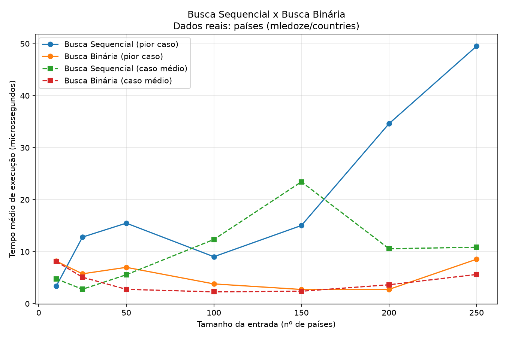

# Consultor de Países — Busca Sequencial x Busca Binária

Trabalho de Estruturas de Dados 2 — Algoritmos de Busca.
Em desenvolvimento.


## Aluna

| Matrícula | Aluna                         |
| --------- | ------------------------------- |
| 231035455 | Letícia Maria de Jesus Lopes    |

---

# Consultor de Países

## Sobre

App de linha de comando que resolve um problema real e simples:
**consultar rapidamente informações de qualquer país do mundo**: capital,
região e área, usando como motor de busca dois algoritmos estudados
na disciplina: **Busca Sequencial** e **Busca Binária**.

O usuário escolhe qual algoritmo usar pra localizar o país, e o app mostra
o tempo que a busca levou, tornando visível, na prática, a diferença de
desempenho entre O(n) e O(log n).

## Fonte de dados

Dataset público [mledoze/countries](https://github.com/mledoze/countries),
hospedado no GitHub — a mesma fonte de dados usada por trás da conhecida
API REST Countries. Sem necessidade de chave de API.

> Nota: a API REST Countries v3.1 foi descontinuada em 2026 e a nova
> versão (v5) passou a exigir cadastro e chave de API. Por isso optei
> por consumir o dataset original diretamente do GitHub:
> `https://raw.githubusercontent.com/mledoze/countries/master/dist/countries.json`

## Como executar

Requer Python 3 e as bibliotecas em `requirements.txt`.

```bash
cd G43_Busca_EDA2-2026.2
pip install -r requirements.txt
cd src
python busca_paises.py
```

Na primeira execução, o app baixa os dados e salva em `src/paises_cache.json`, pra não precisar baixar de novo toda vez.

## Funcionalidades

1. **Buscar informações de um país**: digite o nome (em inglês) e escolha
   o algoritmo: sequencial ou binário. O app mostra a capital, região,
   sub-região, área e o tempo de execução da busca.
2. **Listar países por região**: veja todos os países de uma região
   (África, Américas, Ásia, Europa, Oceania).
3. **Comparar desempenho**: roda um benchmark completo dos dois
   algoritmos em vários tamanhos de entrada e gera um gráfico comparativo.

## Estruturas e algoritmos usados

- **Vetor (`list`)**: armazena os nomes dos países, usado como estrutura
  de dados sobre a qual os algoritmos de busca operam.
- **Dicionário (`dict`)**: guarda os detalhes de cada país (capital,
  região, sub-região, área) para exibição após a busca.
- **Busca Sequencial**: percorre o vetor item a item — O(n). Não exige
  ordenação prévia.
- **Busca Binária**: divide o vetor ordenado ao meio a cada tentativa —
  O(log n). Exige que o vetor esteja ordenado antes da busca.

## Estrutura do código (`src/busca_paises.py`)

| Camada | Função | O que faz |
|---|---|---|
| Dados | `carregar_dados()` | Busca os países (ou usa cache local) |
| Algoritmos | `busca_sequencial(vetor, chave)` | Implementação O(n) |
| Algoritmos | `busca_binaria(vetor_ordenado, chave)` | Implementação O(log n) |
| Medição | `medir_tempo(...)` | Mede tempo médio de execução |
| Medição | `rodar_experimento(...)` | Roda o benchmark completo |
| Medição | `gerar_grafico(...)` | Plota o gráfico comparativo |
| App | `opcao_buscar_pais(...)` | Busca interativa + exibição de detalhes |
| App | `opcao_listar_por_regiao(...)` | Lista países de uma região |
| App | `opcao_comparar_desempenho(...)` | Aciona o benchmark pelo menu |
| App | `menu_principal()` | Loop do menu interativo |

## Resultados do experimento

Execução real com os 250 países do dataset, 200 repetições por medição:

| Tamanho (n) | Sequencial (pior caso) | Binária (pior caso) | Sequencial (caso médio) | Binária (caso médio) |
|---|---|---|---|---|
| 10  | 0.84 µs  | 0.65 µs | 0.51 µs  | 0.44 µs |
| 25  | 2.88 µs  | 1.80 µs | 1.30 µs  | 1.33 µs |
| 50  | 6.14 µs  | 2.12 µs | 1.50 µs  | 0.57 µs |
| 100 | 10.40 µs | 3.63 µs | 0.42 µs  | 0.79 µs |
| 150 | 13.63 µs | 1.13 µs | 2.22 µs  | 0.22 µs |
| 200 | 24.38 µs | 8.92 µs | 12.92 µs | 2.72 µs |
| 250 | 16.90 µs | 2.73 µs | 25.49 µs | 1.14 µs |



## Conclusão

Os resultados confirmam, na prática, o que a teoria prevê para o **pior
caso**: a busca sequencial cresce de forma aproximadamente linear com o
tamanho da entrada (de 0.84 µs com 10 países para 24.38 µs com 200
países), enquanto a busca binária se mantém consistentemente mais rápida
e estável, mesmo em conjuntos maiores — o comportamento esperado de
O(n) contra O(log n).

Já o **caso médio** (busca por um país aleatório que existe na lista)
apresenta mais variação entre as execuções — por exemplo, em n=250 o
tempo da sequencial no caso médio (25.49 µs) chegou a superar o do pior
caso (16.90 µs). Isso não é uma falha do algoritmo, e sim ruído esperado:
como o país sorteado muda a cada execução, às vezes ele cai perto do
início do vetor (busca rápida) e às vezes perto do fim (busca lenta). É
justamente por isso que o experimento roda 200 repetições por medição e
por que o pior caso é a métrica mais confiável para observar a tendência
assintótica dos algoritmos.

Na prática, a busca sequencial continua sendo uma escolha razoável para
listas pequenas ou que mudam com frequência, já que não exige nenhuma
preparação prévia dos dados. Já a busca binária compensa claramente em
listas maiores e relativamente estáveis — como o cadastro de países,
que muda muito raramente — pois o custo de mantê-la ordenada se paga
rapidamente com buscas muito mais rápidas depois.

## Vídeo de apresentação

*(cole aqui o link do vídeo antes da entrega)*
